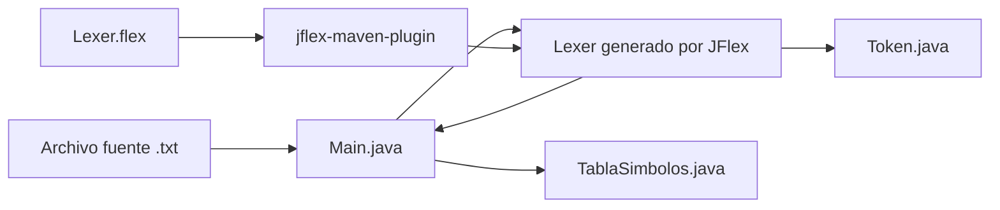
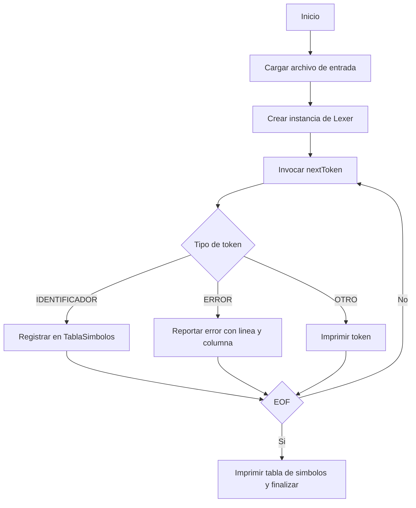

# TurboX - Parte 1

Analizador lexico implementado con Java y JFlex.

## Indice

1. [Propósito](#proposito)
2. [Contexto de entrega](#contexto-de-entrega)
3. [Alcance funcional](#alcance-funcional)
4. [Requerimientos del proyecto y cumplimiento](#requerimientos-del-proyecto-y-cumplimiento)
5. [Arquitectura del sistema](#arquitectura-del-sistema)
6. [Estructura del proyecto](#estructura-del-proyecto)
7. [Manual de usuario](#manual-de-usuario)
8. [Manual técnico](#manual-tecnico)
9. [Formato de entrada y salida](#formato-de-entrada-y-salida)
10. [Limitaciones conocidas](#limitaciones-conocidas)

## Proposito

TurboX es un experimento academico para el estudio de compiladores.
El objetivo es construir y validar un scanner (analizador lexico) que reconozca tokens de un lenguaje fuente, reporte errores lexicos con posicion y mantenga una tabla de simbolos de identificadores.

## Contexto de entrega

Esta documentacion describe la **Parte 1** del proyecto TurboX.
La entrega cubre de forma integral la fase de analisis lexico, incluyendo especificacion de tokens, deteccion de errores lexicos con ubicacion precisa, estructura de tabla de simbolos y evidencia de ejecucion por consola.

## Alcance funcional

- Reconocimiento de tokens mediante expresiones regulares en JFlex.
- Clasificacion de palabras reservadas, tipos de datos, operadores, identificadores y literales.
- Deteccion de caracteres no definidos con reporte de linea y columna.
- Registro de identificadores en tabla de simbolos.
- Ejecucion por consola para inspeccion de resultados.
- Consolidacion del baseline tecnico de la fase 1 para evolucion posterior del compilador.

## Requerimientos del proyecto y cumplimiento

| Requerimiento | Implementacion en TurboX | Estado |
|---|---|---|
| Definicion de tokens del lenguaje | Reglas en `src/main/jflex/Lexer.flex` y tipos en `src/main/java/Token.java` | Cumplido |
| Palabras reservadas (`INICIO`, `FIN`, `SI`, `ENTONCES`, `SINO`, `MIENTRAS`, `HACER`) | Reglas literales en `Lexer.flex` | Cumplido |
| Tipos de datos (`Logico`, `Entero`, `Real`, `Caracter`, `Cadena`) | Reglas dedicadas en `Lexer.flex` | Cumplido |
| Operadores aritmeticos, relacionales y asignacion | Reglas para `+`, `-`, `*`, `/`, `^`, `**`, `=`, `>`, `<`, `==`, `!=` | Cumplido |
| Identificadores y literales | Macros `IDENT`, `ENTERO`, `REAL`, `CADENA`, `CARACTER` | Cumplido |
| Analisis de errores lexicos | Regla comodin `.` con token `ERROR` y posicion | Cumplido |
| Reporte de linea y columna | Directivas `%line`, `%column` + impresion en `Main` | Cumplido |
| Tabla de simbolos | Clase `TablaSimbolos` con almacenamiento de identificadores | Cumplido |
| Pruebas de salida por consola | Flujo de ejecucion en `Main` con impresion de tokens/errores | Cumplido |

## Arquitectura del sistema

### Diagrama de componentes



### Diagrama de flujo del analisis lexico



## Estructura del proyecto

```text
TurboX/
  pom.xml
  src/
	main/
	  java/
		Main.java
		Token.java
		TablaSimbolos.java
	  jflex/
		Lexer.flex
	  resources/
		entrada.txt
	test/
	  java/
```

## Manual de usuario

### Requisitos de ejecucion

- Java 17 o superior.
- Maven 3.8 o superior.

### Compilacion y ejecucion

```powershell
mvn clean compile
java -cp "target/classes" Main src/main/resources/entrada.txt
```

### Ejecucion con archivo personalizado

```powershell
java -cp "target/classes" Main "ruta/al/archivo.txt"
```

## Manual tecnico

### Componentes principales

- `Main.java`: punto de entrada; orquesta lectura de archivo, iteracion de tokens e impresion de resultados.
- `Lexer.flex`: especificacion lexico-gramatical; fuente para la generacion automatica del scanner.
- `Token.java`: estructura de datos para representar token, lexema y posicion.
- `TablaSimbolos.java`: almacenamiento de identificadores unicos detectados en el analisis.

### Pipeline de construccion

1. `mvn generate-sources` ejecuta JFlex sobre `Lexer.flex`.
2. Se genera `Lexer.java` en `target/generated-sources/jflex`.
3. Maven incorpora las fuentes generadas al classpath de compilacion.
4. `mvn compile` compila codigo manual y codigo generado.

### Extension del analizador

Para agregar un nuevo token:

1. Incorporar tipo en `Token.Tipo`.
2. Agregar regla en `Lexer.flex` respetando prioridad de patrones.
3. Ejecutar `mvn clean compile` para regenerar y recompilar.

## Formato de entrada y salida

### Entrada

Archivo de texto plano con codigo fuente TurboX.

### Salida

- Tokens reconocidos en formato: `TOKEN: <TIPO>, VALOR: <LEXEMA>, LINEA: <N>, COLUMNA: <M>`.
- Errores lexicos en formato: `Error lexico detectado en linea N, columna M: simbolo no reconocido 'X'`.
- Tabla de simbolos final con identificadores detectados.

## Limitaciones conocidas

- Esta entrega corresponde a la Parte 1: cubre analisis lexico y no incluye parser sintactico ni analisis semantico.
- El manejo de comentarios no se encuentra definido en esta version base.


